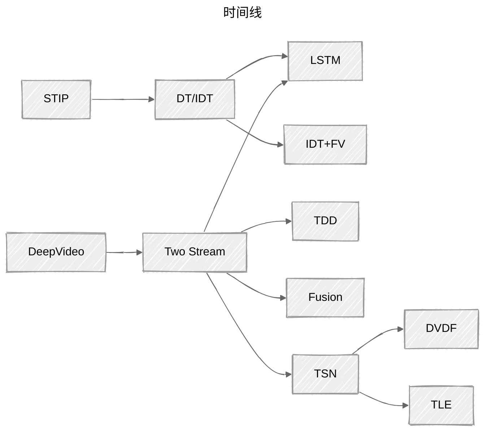

<iframe src="//player.bilibili.com/player.html?isOutside=true&aid=853205150&bvid=BV1fL4y157yA&cid=576076417&p=1" scrolling="no" border="0" frameborder="no" framespacing="0" allowfullscreen="true"></iframe>

> 【视频理解论文串讲（上）【论文精读】】 https://www.bilibili.com/video/BV1fL4y157yA/?share_source=copy_web&vd_source=5c87dbd20cc0bcba1008ebe80abdab66

## 时间线

> - 综述: A Comprehensive Study of Deep Video Action Recognition
    - [link](https://arxiv.org/pdf/2012.06567)

时间线如下：

从Deep Video，纯粹的深度学习，到使用特征提取的双流网络（用光流教网络学习），之后出现了3D网络，最后来到流行Video Transformer的现在(2024年)。

## 主要内容

1. 手工 -> CNN
2. 双流网络
3. 3维卷积
4. video transformer

## CNN

> - A. Karpathy, G. Toderici, S. Shetty, T. Leung, R. Sukthankar and L. Fei-Fei, "Large-Scale Video Classification with Convolutional Neural Networks," 2014 IEEE Conference on Computer Vision and Pattern Recognition, Columbus, OH, USA, 2014, pp. 1725-1732, doi: 10.1109/CVPR.2014.223.
>   - [link](https://static.googleusercontent.com/media/research.google.com/en//pubs/archive/42455.pdf) 

### fusion

Single Frame是对单个图片进行操作，属于图片分类；后三个变体是视频。

Late Fusion用两个权值共享的网络分别输入随机选取的两个帧，得到的特征最后合并，在全连接层输出；Early Fusion输入5个帧，在RGB通道上合起来，之后和Late Fusion一样。这样更能获取时间信息；Slow Fusion结合Late Fusion和Early Fusion，抽取10个帧输入，每4帧通过一个CNN，抽出特征，合并为2个片段，最后进行conv和fc。

3种方法效果差异不大，但是都不好，效果不如手工特征。

### 多分辨率

两支网络中，fovea那条学习视频中央的内容，context那支学习整张图片的内容。两支网络是权值共享的，可以理解成一种双流，同时对中央的处理可以理解为一种注意力机制。

有一些效果:

## Two-Stream

> - Simonyan, K., & Zisserman, A. (2014). Two-stream convolutional networks for action recognition in videos. Advances in neural information processing systems, 27.
>   - [link](https://arxiv.org/pdf/1406.2199)

模型如下:

视频帧输入两个网络，一个处理RGB图像，处理空间信息，学习RGB到分类的映射；一个处理光流图像，学习时间信息，学习光流图到分类的映射。RGB是单张的，光流图像由10帧视频得到。

网络使用Late Fusion，是AlexNet的变体。

基于本网络，可以由如下改进:

1. 使用Early Fusion
2. 换更深的网络
3. 使用LSTM
4. 增长处理的视频的长度

### LSTM

> - Yue-Hei Ng, J., Hausknecht, M., Vijayanarasimhan, S., Vinyals, O., Monga, R., & Toderici, G. (2015). Beyond short snippets: Deep networks for video classification. In Proceedings of the IEEE conference on computer vision and pattern recognition (pp. 4694-4702).
>   - [link](https://arxiv.org/pdf/1503.08909)

模型:

LSTM的使用方法如下:

图中的C是卷积网络最后抽出来的特征，网络是权值共享的。特征具有时序信息，用5层LSTM处理之前的特征。橘黄色的方块是softmax

不过LSTM的效果不是那么显著

LSTM发挥效果需要输入有较大语义的改变。短视频没什么语义的变化，所以LSTM的效果不会很好。——up的观点。

### Early Fusion

> - Feichtenhofer, C., Pinz, A., & Zisserman, A. (2016). Convolutional two-stream network fusion for video action recognition. In Proceedings of the IEEE conference on computer vision and pattern recognition (pp. 1933-1941).
>   - [link](https://arxiv.org/pdf/1604.06573)

论文讲解了怎么融合时空信息

这是**spatial fusion**:

#### Spatial Fusion

需要保证时间流与空间流的特征图在同样的位置上，产生的channel response要能联系起来

**max fusion**:

对于特征图$a$和$b$在同样位置上只取最大值

$$
y_{i,j,d}^{max} = max \lbrace x_{i,j,d}^a, x_{i,j,d}^b \rbrace
$$

**concatenation fusion**

把两个特征图合并起来

**Conv Fusion**

先堆叠特征图，然后做卷积操作

$$
y^{conv} = f^{conv}(x^a,x^b)
$$

$$
y^{conv} = y^{cat} * f + b
$$

**Sum Fusion**

直接加起来

**Bilinear fusion**

对特征图outer product，加权平均。计算复杂度高。

实际上**Conv fusion**表现就可以了

#### 在哪里融合

有两种选择:

左：conv4之后进行，由两个网络变成一个网络。

右：表现更好。到conv5时，空间流的特征与时间流合并，产生时空的特征，但是空间流的特征继续用。在fc8再次合并。

#### Temporal Fusion

有两种方法，一种是3D pooling，一种是先做3D Conv，再做3D pooling

解决上述问题后，作者提出模型的**总体框架**:

蓝色是空间流，绿色是时间流，对RGB和光流都是分别用两个网络抽特征，在conv做early fusion，然后先3D conv fusion，然后3d pooling，然后特征融合并pool得到fc，算出spatiotemporal损失函数;
作者又把时间流单独拿出来，一次pooling，接fc，然后是时间上的损失函数。

网络的两个结果做late fusion，加权平均

结果:

### 增长时间

> - Wang, Limin, et al. "Temporal segment networks: Towards good practices for deep action recognition." European conference on computer vision. Springer, Cham, 2016.
>   - [link](https://arxiv.org/pdf/1608.00859)

视频被分为多段，分别输入双流，得到的logits进行segmental consensus(融合)，得到的空间上和时间上的共识做late fusion得到预测

#### 论文中的技巧

**Cross Modality Pre-training**

可以用ImageNet预训练的模型训练光流图。这么做需要调整通道数量。RGB:3通道，光流: 10通道。在网络第一层对预训练的参数取平均，3通道变1通道，复制20遍变成20个通道

**Regularization Techniques**

使用**partial BN**，第一层BN学，剩下的冻住。

**Data Augmentation**

两种方法——corner cropping与scale-jittering。corner cropping是裁剪图像边角；scale-jittering是改变图片的长宽比。图片先缩放成$256 \times 340$，然后在{256, 224, 192, 168}之间抽两个作为长宽比。

效果:

## 发展历程

